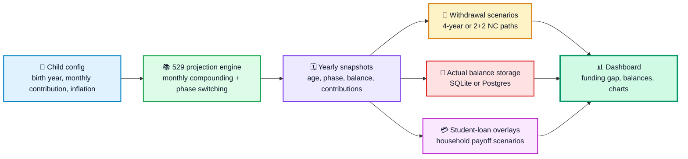
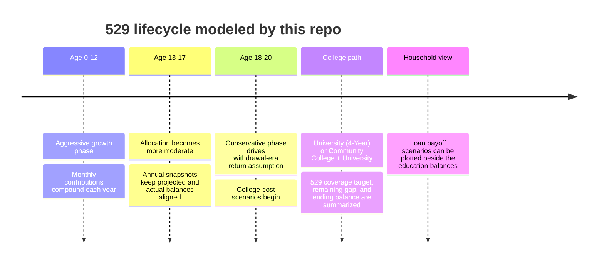

# Education Calculator

FastAPI + Jinja2 + Chart.js dashboard for long-horizon 529 planning and student-loan overlays, with scenario modeling for college withdrawals.

This README is intentionally detailed for engineers who are advanced in Python but beginner-to-intermediate in HTML/CSS.

---

## 1) What this app does

- Projects each child’s 529 balance from age 0 through age 20.
- Stores yearly actual 529 balances and computes projected-vs-actual deltas.
- Draws combined visualization of:
  - 529 projected/actual series
  - household student-loan payoff scenarios
- Supports education withdrawal “standard deduction” scenarios:
  - University (4-year)
  - Community College + University (2+2)

---

## 2) Stack and runtime model

- Backend: FastAPI + SQLAlchemy
- Server-rendered views: Jinja2
- Front-end rendering: Chart.js + vanilla JavaScript
- Local DB default: SQLite (`education.db`)
- Production DB support: PostgreSQL via `DATABASE_URL`

Dependencies are listed in [requirements.txt](requirements.txt).

---

## 3) Project architecture and boundaries

Main entrypoints:

- [app/main.py](app/main.py)
- [Procfile](Procfile)
- [start_web.ps1](start_web.ps1)

Core modules:

- Boot/config
  - [app/main.py](app/main.py): app creation, middleware, route registration
  - [app/config.py](app/config.py): env config, 529 defaults, DB URL normalization
- Persistence
  - [app/models.py](app/models.py): `Child`, `Account529`, `ActualBalance`
  - [app/database.py](app/database.py): engine/session setup, schema init, child seeding
  - [app/schemas.py](app/schemas.py): request/response DTOs
- API and page routes
  - [app/routes/dashboard.py](app/routes/dashboard.py): `GET /` and initial hydration payload
  - [app/routes/projections.py](app/routes/projections.py): comparison APIs
  - [app/routes/balances.py](app/routes/balances.py): actual-balance CRUD
- Domain logic
  - [app/services/projection.py](app/services/projection.py): wraps pure calculator output
  - [app/services/comparison.py](app/services/comparison.py): merges projected, actual, deltas, and household loan data
  - [app/services/education_withdrawals.py](app/services/education_withdrawals.py): 529 withdrawal path scenarios
  - [app/services/loans.py](app/services/loans.py): household student-loan amortization scenarios
  - [lib/calculator.py](lib/calculator.py): pure numerical engine
- Front-end
  - [app/templates/base.html](app/templates/base.html)
  - [app/templates/dashboard.html](app/templates/dashboard.html)
  - [app/static/css/dashboard.css](app/static/css/dashboard.css)
  - [app/static/js/chart.js](app/static/js/chart.js)

---

## 4) Python domain flow

### 4.1 Projection pipeline

1. Route requests child comparison.
2. [app/services/projection.py](app/services/projection.py) invokes `lib/calculator.py`.
3. Output is normalized into API-facing yearly points:
   - `year`, `age`, `balance`, `phase`, `phase_key`, `contributions_ytd`

### 4.2 Comparison assembly

[app/services/comparison.py](app/services/comparison.py):

- pulls projected rows,
- fetches DB actual rows,
- computes yearly deltas,
- attaches withdrawal scenarios from [app/services/education_withdrawals.py](app/services/education_withdrawals.py),
- attaches household loan projection from [app/services/loans.py](app/services/loans.py) when requesting all children.

### 4.3 Withdrawal scenario engine

[app/services/education_withdrawals.py](app/services/education_withdrawals.py):

- Uses NC cost assumptions (tuition + room/board) with inflation uplift per year.
- Simulates two path definitions (`direct_4yr`, `blended_2plus2`).
- Applies 529 coverage target (`covered_ratio`, currently 0.9).
- Produces:
  - annual cost details
  - paid-vs-remaining split
  - balance timeline
  - summary rollups

### 4.4 Loan projection engine

[app/services/loans.py](app/services/loans.py):

- Uses monthly amortization loop with APR and payment scenarios.
- Emits yearly and fractional-year snapshots until payoff.
- Returns baseline + alternate payment scenarios for chart overlays.

---

## 5) HTML/CSS walkthrough (backend-friendly)

### 5.1 Template composition

- [app/templates/base.html](app/templates/base.html) is the shared skeleton.
- [app/templates/dashboard.html](app/templates/dashboard.html) extends it and defines:
  - control bar
  - chart canvas
  - phase/snapshot/funding sections
  - delta table
  - create/edit modals

In Python terms: `base.html` is your reusable abstract base view, while `dashboard.html` is the concrete specialization.

### 5.2 Why IDs matter here

This front-end is vanilla JS, so IDs are the contract surface:

- `#childSelect`
- `#deductionToggle`
- `#deductionPathSelect`
- `#educationChart`
- `#deltaContent`

JS selectors and event handlers in [app/static/js/chart.js](app/static/js/chart.js) depend directly on these IDs.

### 5.3 CSS system design

In [app/static/css/dashboard.css](app/static/css/dashboard.css):

- `:root` holds design tokens (colors, shadows, gradients, borders).
- Components are class-driven (`.control-group`, `.chart-container`, `.modal`, `.btn-primary`).
- Layout uses modern flex/grid patterns with responsive breakpoints.
- Typography is served locally through Montserrat `@font-face` declarations.

If you are new to CSS: read it as “rules bound to selectors.” A selector targets elements; declarations modify rendering behavior in browser layout/paint phases.

---

## 6) Front-end chart orchestration

The JS orchestrator is [app/static/js/chart.js](app/static/js/chart.js).

Key responsibilities:

- hold current state (`allChildrenData`, deduction toggles, selected path)
- normalize chart datasets (projected, actual, loans)
- keep a split legend for account series vs loan series
- render single-child or all-child views
- rebuild chart and cards when toggles change
- submit CRUD calls for actual balances and refresh UI

Chart rendering approach:

- x-axis uses linear years
- each series maps to `{x, y}` points
- loan scenarios use dashed lines and fixed palette
- tooltip callbacks enrich displayed context

---

## 7) API endpoints

From [app/routes/projections.py](app/routes/projections.py) and [app/routes/balances.py](app/routes/balances.py):

- `GET /api/comparison/{child_name}`
- `GET /api/comparison-all`
- `POST /api/balances/{child_name}`
- `GET /api/balances/{child_name}`
- `PUT /api/balances/{balance_id}`
- `DELETE /api/balances/{balance_id}`

Page route:

- `GET /`

Health route:

- `GET /health`

---

## 8) Security model

Shared pattern with retirement app:

- [app/auth.py](app/auth.py)
  - HTTP Basic auth
  - local-host bypass for development
  - guest read-only semantics
  - editor write permissions
- [app/security_headers.py](app/security_headers.py)
  - CSP and browser hardening headers

Auth env vars:

- `AUTH_STEVEN_PASSWORD`
- `AUTH_ALYSSA_PASSWORD`
- `AUTH_GUEST_PASSWORD`

---

## 9) Local development

Quick start:

```powershell
cd education-calculator
.\start_web.ps1
```

Manual:

```powershell
python -m venv venv
.\venv\Scripts\Activate.ps1
pip install -r requirements.txt
uvicorn app.main:app --reload --port 8001
```

The app runs on `8001` to avoid collision with retirement app default `8000`.

---

## 10) Railway hosting (how deployment works)

### 10.1 Deployment contract already present

- [Procfile](Procfile) starts the service on Railway-provided port:
  - `uvicorn app.main:app --host 0.0.0.0 --port $PORT`
- [app/config.py](app/config.py) normalizes `DATABASE_URL` from Railway format.
- PostgreSQL driver is included in [requirements.txt](requirements.txt).

### 10.2 Typical Railway setup

1. Create Railway project from this repo.
2. Attach a PostgreSQL service.
3. Set environment variables:
   - `DATABASE_URL` (usually auto-injected)
   - `AUTH_STEVEN_PASSWORD`
   - `AUTH_ALYSSA_PASSWORD`
   - `AUTH_GUEST_PASSWORD`
   - optional: `DEBUG`, `ALLOWED_ORIGINS`
4. Deploy.

### 10.3 Startup behavior on Railway

- FastAPI app starts from `app.main:app`.
- Lifespan hook triggers `init_db()` from [app/database.py](app/database.py).
- Tables are created if absent.
- Seed children from `data/children.json` if not already present.

### 10.4 Practical production notes

- Keep auth passwords non-empty.
- Prefer Postgres in Railway over SQLite for persistent multi-instance behavior.
- If schema complexity grows, move from `create_all` startup to explicit migrations.

---

## 11) Suggested engineering improvements

- Add migration tooling (Alembic).
- Add API contract tests around comparison and scenario payloads.
- Consider extracting repeated auth/header middleware into a shared package used by both calculators.
- Add a typed front-end boundary (TypeScript or JSON schema validation) for JS payload safety.

---

## 12) Visual guide: how the education planner works

This section is the “fun but precise” version of the README for someone who wants the whole mental model quickly.



### From birth to college in one picture



### Model assumptions at a glance

- The 529 engine uses `2026` as the base-dollar year for inflation adjustments unless overridden.
- Projection phases are age-banded: `0-12`, `13-17`, and `18-20`, with each phase using its configured blended annual return.
- Contributions grow each year using `annual_contribution_growth_rate`, while compounding is simulated monthly for the balance engine.
- Withdrawal scenarios start at age `18` and use North Carolina public-school anchors: UNC Chapel Hill and Central Piedmont Community College.
- Tuition and room/board are inflated forward from 2026 assumptions using the child-specific inflation rate.
- The withdrawal model targets `90%` 529 coverage by default and uses the phase-3 allocation return during college years.
- Contributions can continue during withdrawal years through age `20`; the final college year does not assume a new contribution if the child is already past that boundary.
- Student-loan overlays are separate household amortization scenarios, so they enrich the dashboard without changing the pure 529 projection math.

### Fast setup recap

For a reader who jumps straight here, the shortest path is:

1. Create and activate a virtual environment.
2. Install dependencies from [requirements.txt](requirements.txt).
3. Start the app with [start_web.ps1](start_web.ps1) or `uvicorn app.main:app --reload --port 8001`.
4. Set `AUTH_STEVEN_PASSWORD`, `AUTH_ALYSSA_PASSWORD`, and `AUTH_GUEST_PASSWORD` if you need authentication outside local development.
5. Open `/` for the dashboard and `/health` to confirm the service is up.

### Best for / not pretending to solve every education-finance problem

**Best for**

- showing whether a child’s 529 plan is directionally on track
- comparing direct 4-year versus 2+2 college paths
- seeing projected balances next to real yearly account snapshots
- understanding how student-loan payoff tradeoffs sit beside education savings

**Not pretending to solve everything**

- private-school cost modeling across every geography
- scholarship, grant, and aid optimization in full detail
- tax-law edge cases around every qualified or non-qualified 529 withdrawal
- certainty about future tuition inflation or market returns
