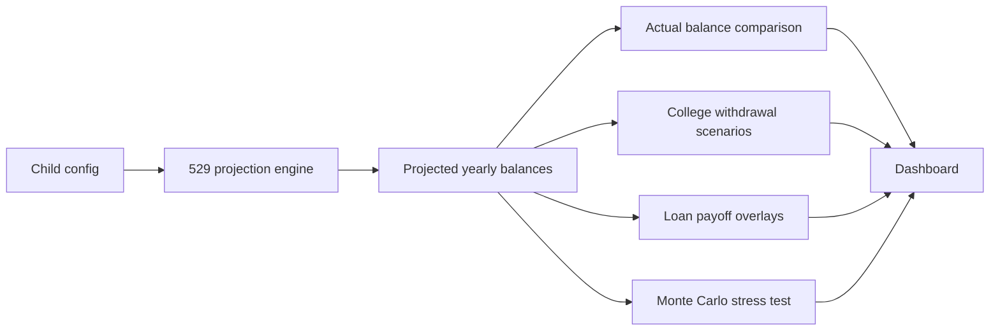

# 🎓 Education Calculator


Plan, track, and stress-test 529 education savings for multiple children in one clean dashboard.

This app combines projected balances, real yearly account snapshots, college withdrawal scenarios, and household loan overlays so you can quickly answer one question: **Are we on track?**

---

## Why this project exists

Most calculators stop at a single projection. This one is built to compare:

- **projected vs actual** 529 balances
- **direct 4-year vs 2+2** college paths
- **education savings vs student-loan payoff** scenarios
- **base projection vs Monte Carlo stress test** outcomes

---

## What it does

| Feature | What you get |
| --- | --- |
| 529 growth modeling | Age-based projection from birth through college years |
| Actual balance tracking | Add, edit, and delete yearly account snapshots |
| Withdrawal planning | Compare 4-year university and community-college-to-university paths |
| Loan overlays | Plot household student-loan payoff scenarios beside savings curves |
| Stress testing | Run Monte Carlo simulations for 4-year college-fund success probability |
| Secure access | Basic auth, local-dev bypass, and hardened security headers |

---

## Snapshot



---

## Tech stack

- **Backend:** FastAPI
- **Database:** SQLite locally, PostgreSQL in production
- **ORM:** SQLAlchemy
- **Templates:** Jinja2
- **Charts:** Chart.js
- **Tests:** Pytest

Key entry points:

- [app/main.py](app/main.py)
- [start_web.ps1](start_web.ps1)
- [Procfile](Procfile)

---

## Quick start

### Option 1: easiest path

```powershell
cd education-calculator
.\start_web.ps1
```

### Option 2: manual setup

```powershell
cd education-calculator
python -m venv venv
.\venv\Scripts\Activate.ps1
pip install -r requirements.txt
uvicorn app.main:app --reload --port 8001
```

Open:

- `http://localhost:8001/`
- `http://localhost:8001/health`

---

## Environment variables

### Auth

Set these outside local development if you want authenticated access:

- `AUTH_STEVEN_PASSWORD`
- `AUTH_ALYSSA_PASSWORD`
- `AUTH_GUEST_PASSWORD`

### Database

- `DATABASE_URL` — optional locally, typical in production

If `DATABASE_URL` is not set, the app uses local SQLite by default.

---

## API surface

### Page + health

- `GET /`
- `GET /health`

### Projection endpoints

- `GET /api/comparison/{child_name}`
- `GET /api/comparison-all`

### Actual balance endpoints

- `POST /api/balances/{child_name}`
- `GET /api/balances/{child_name}`
- `PUT /api/balances/{balance_id}`
- `DELETE /api/balances/{balance_id}`

### Stress test endpoints

- `GET /api/stress-test/{child_name}`
- `POST /api/stress-test/{child_name}/recalculate`

---

## Project layout

```text
education-calculator/
├─ app/
│  ├─ main.py              # FastAPI app setup
│  ├─ auth.py              # Basic auth and roles
│  ├─ database.py          # engine, sessions, initialization
│  ├─ models.py            # SQLAlchemy models
│  ├─ routes/              # page and API routes
│  ├─ services/            # projections, withdrawals, loans, Monte Carlo
│  ├─ static/              # CSS and JavaScript
│  └─ templates/           # Jinja templates
├─ data/children.json      # seeded child configurations
├─ lib/calculator.py       # pure projection math
├─ tests/                  # pytest coverage
├─ requirements.txt
└─ start_web.ps1
```

---

## Core assumptions

- Child allocations shift across **3 age bands**: growth, moderate, conservative.
- Contributions compound over time and can grow annually.
- Withdrawal scenarios use **North Carolina public-school cost anchors**.
- Monte Carlo testing currently targets the **direct 4-year university** path.
- The dashboard supports up to **3 seeded children** out of the box.

See [data/children.json](data/children.json) to adjust assumptions.

---

## Testing

```powershell
cd education-calculator
.\venv\Scripts\python.exe -m pytest -q
```

---

## Deployment notes

This project is ready for simple platform deployment.

- [Procfile](Procfile) starts `uvicorn`
- PostgreSQL is supported through `DATABASE_URL`
- startup initializes tables and seeds child data when needed

Good fit for platforms like Railway.

---

## Best for

- families tracking real 529 progress over time
- comparing education funding paths without opening spreadsheets
- pairing college savings planning with loan payoff visibility
- getting a quick probability-based read on plan durability

## Not trying to be

- a full tax-planning engine
- a financial-advice product
- a scholarship/aid optimizer
- a universal tuition model for every school and geography

---

## In one line

**A focused FastAPI dashboard for 529 planning, actual balance tracking, college-cost scenarios, and education funding stress tests.**
